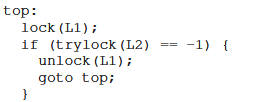
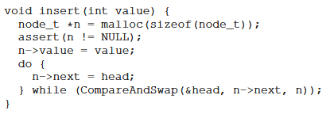

# common concurrency problems

early researcher only focused in deadlocks, but they arent the only type of problems...

### 32.1 whay types of bugs exist?

in a research with MySQL, Apache, Mozilla and OpenOffice, it showed that there are more than the double of NON-deadlock bugs than deadlock bugs.

### 32.2 non-deadlock bugs

Atomicity Violation Bugs

  ```c
    Thread 1::
    if (thd->proc_info) {
        ...
        fputs(thd->proc_info, ...);
        ...
    }

    Thread 2::
    thd->proc_info = NULL;
  ```
  
  may try to print NULL and crases

  "the desired serializability among multiple memory accesses is violated" -> assumption of atomicity

  a simple solution is lock

  ```c
    pthread_mutex_t lock = PTHREAD_MUTEX_INITIALIZER;

    Thread 1::
    pthread_mutex_lock(&lock);
    if (thd->proc_info) {
        ...
        fputs(thd->proc_info, ...);
        ...
    }
    pthread_mutex_unlock(&lock);

    Thread 2::
    pthread_mutex_lock(&lock);
    thd->proc_info = NULL;
    pthread_mutex_unlock(&lock);
  ```

Order Violation Bugs
  ```c
    Thread 1::
    void init() {
        ...
        mThread = PR_CreateThread(mMain, ...);
        ...
    }

    Thread 2::
    void mMain(...) {
        ...
        mState = mThread->State;
        ...
    }
  ```
  
  assumes that mThread has been initiliazed

  "the desired order between two memory accesses is flipped" -> "A should always run before B"

  solution: conditional variable

  ```c
    pthread_mutex_t mtLock = PTHREAD_MUTEX_INITIALIZER;
    pthread_cond_t mtCond = PTHREAD_COND_INITIALIZER;
    int mtInit = 0;

    Thread 1::
    void init() {
        ...
        mThread = PR_CreateThread(mMain, ...);

        // signal that the thread has been created...
        pthread_mutex_lock(&mtLock);
        mtInit = 1;
        pthread_cond_signal(&mtCond);
        pthread_mutex_unlock(&mtLock);
        ...
    }

    Thread 2::
    void mMain(...) {
        ...
        // wait for the thread to be initialized...
        pthread_mutex_lock(&mtLock);
        while (mtInit == 0)
            pthread_cond_wait(&mtCond, &mtLock);
        pthread_mutex_unlock(&mtLock);

        mState = mThread->State;
        ...
    }
  ```

### 32.3 deadlock bugs


another reason, its the common encapsulation, that makes easier to code but keep us distance from the low-level implementation, so we dont know if the lock its done right

  ```java
  Vector v1, v2;
  v1.AddAll(v2);
  ```

Condition to NOT occur deadlock

- circular wait: ordering the acquiring of lock. ex.: L1 always before L2 (in all threads)
- hold and wait: acquire all locks all at once
  ```c
  lock(prevention);
  lock(L1);
  lock(L2);
  ...
  unlock(prevention);
  ```

- no preemption: using trylock() routines
  
  (livelock problem: repeatdly failing to acquire the lock)

- mutual exclusion: dont rely on mutual exclusion bicth! use compare and swap

  

  imagine a list insertion method

  

  using compare and swap

  

- deadlock avoidance via scheduling: scheduler just schedule threads that arent able to deadlock

  
  

  T1 and T2 cant be schedule together, T1 and T3 yes because it doesnt causes a deadlock

- detect and recover: let it happen and deal with it later :)