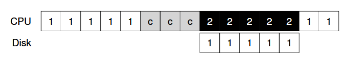

# I/O devices

**<crux> how to integrate I/O into systems? </crux>**

### 36.1 system architecture


why hierachical? because it's costly and physical space is crucial

the faster a bus is, the shorter it must be (too expensive and so less devices will be pluged -> less delay)

### 36.2 a canonical device


interface: allows the system software to control its operation

internals: implements the abstraction the device presents to the system

### 36.3 the canonical protocol

by using the registers presented into interface, the protocol is the following:

```pseudo
  while (STATUS == BUSY)
    ; // espera até não estar mais ocupado
  write data to DATA register
  write command to COMMAND register
  while (STATUS == BUSY)
    ; // espera até finalizar o processo
```

programmed I/O: when the main CPU is involved with the data movement
  -> the canonical protocol it's PIO, because the CPU executes (read and run) the data transfer between device and memory

this basic protocol its simple and works, but its not eficcient bc of polling (line 27)

### 36.4  lowering CPU overhead with interrupts

instead of polling, the OS issue a request, sleep the process and context switch
when the I/O is done, raise a hardware interrupt -> CPU jumps into the OS at a pre-determined interrupt handler


in this case it stays polling and wasting CPU time (without interrupt)


in this case its done a context switch, so process 2 gains the CPU

by other side, context switch can cause a overhead too

```
the basic choice is
  if (device_is_slow) 
    use interrupt
  else
    use PIO
```

hybrid way its good (polls a little and if its not finished, interrupt it)

in networks, its possible to occurs a livelock, that is only dealing with interrupts of a big load of packages and then you just dont process anything, you just deals with interrupt (overhead of context switch)

another way its too coalescing (buffering the interrupts)

### 36.5 more efficient movement with DMA



P1 is running and request a write to some data to disk
  1st: copy data from memory
  2nd: write
the first step depends on CPU, consuming three time slices (in the image example)


with a DMA (Direct Access Memory) it's easier.
CPU doesnt has to deal with copying memory info, the DMA deals with it.
therefore, P2 can run while P1 I/O request is done.

### 36.6 methods of device interaction

✝️ **how to communicate with devices?**

1st method: I/O instructions
  -> specify a way for the OS to send data to specif device registers (as was done in the canonical protocol)
  -> ex.: in x86 arch, there are IN and OUT instructions (priviligied ones) to send data. the caller specifies a register with the data in it and a port of the device

2nd method: memory mapped I/O
  -> hw makes device register available like memory locations, OS issues to read and write the address

### 36.7 fitting into the OS: the device driver

the problem is the crux:
✝️ **HOW TO BUILD A DEVICE-NEUTRAL OS?**
  how can we keep most of the OS device-neutral, thus hiding the details of device interactions from major OS subsystems?

this was solved by the abstraction of a DEVICE DRIVER
it deals with any specifics of device interaction, everything its encapsuled within it


FILE SYSTEM --- issues block read and write request ---> GENERIC BLOCK LAYER (GBL)
GBL ------ routes the requests to the appropriate device driver ---> DEVICE DRIVER

DD handles the details of request