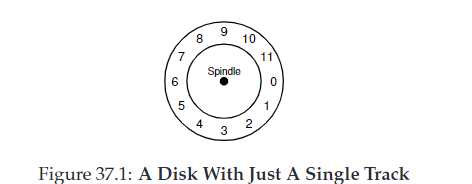
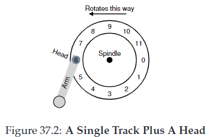
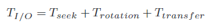
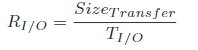
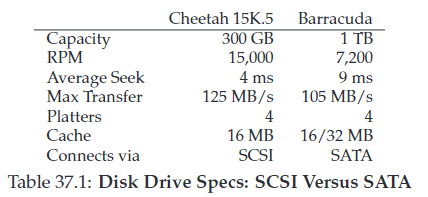
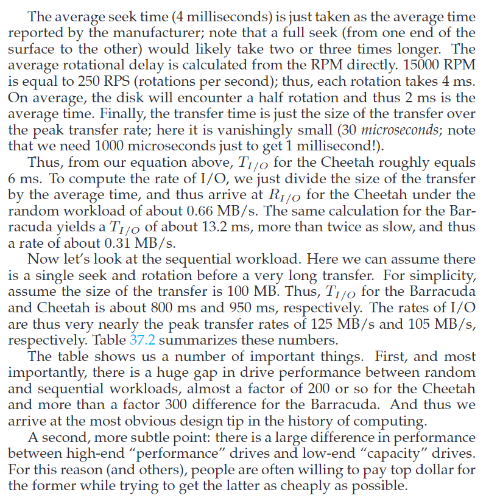
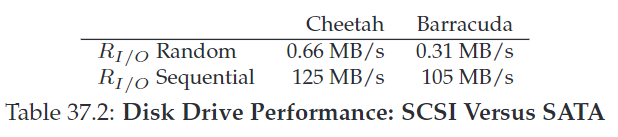
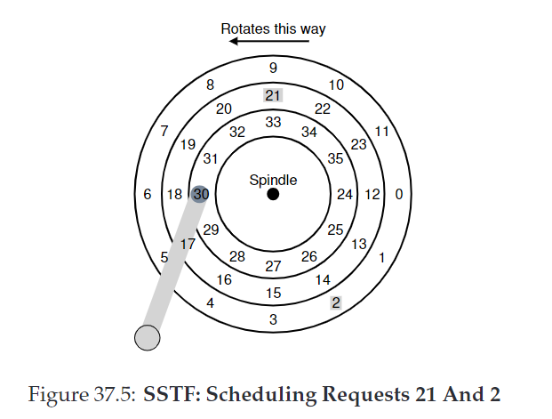
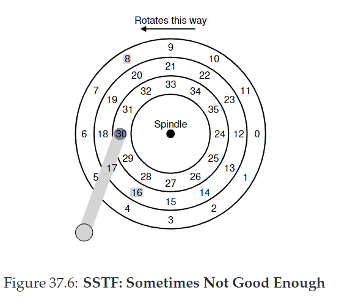

# Hard Disk Drives

they were the main form of data storage for decades.
we need to understand how the disk works, for so learn about file systems.

## 37.1 the inferface

the drive is a large number of sectors (512 bytes-blocks) that can be read or written.

address space is from 0 to (**n**-1), in a drive w/ **n** sectors.

multi-sector operations are common (ex.: 4KB r/w op).

single 512-byte write is atomic (or it's entirely completed or its not completed, i.e there isnt a half completed written).

## 37.2 basic geometry

- platter: where the data is magnetic induced
- surface: sides of a platter
- spindle: let it rip?!
- Rotations Per Minute (RPM)
- track: one concenctric circle that contains sections
- disk head/arm: reader and writer/arm of it

## 37.3 a simple disk drive

this track has just 12 sectors, each with 512 bytes.
it's addressed from 0 to 11.

**single track latency: the rotational delay**
it's the full rotation delay R.
in the image above, to the readers gets to the position 0, it would take R/2.

**multiple tracks: seek time**
time to find the correct track.
it's composed by acceleration, coasting and deceleration.

**some other details**
track skew: técnica de deslocar os setores em trilhas adjacentes, de forma que o próximo setor esteja sincronizado com o tempo que leva para o cabeçote mudar de track.

track buffer: por exemplo, chega a instrução de ler o setor 5, entõa para otimizar, o disco já bufferiza e traz pra cache os setores 6,7 e 8.

write-through: confirma após gravar fisicamente
write-back: confirma após gravar na cache

## 37.4 I/O time: doing the math 🔥

### random workload
assume each 4KB read

**cheetah**
Tseek = 4ms 
Trotation = 15k router per minute = 15k / 60 = 250 routes per s = 0,004s por rotação = 4ms por rotação => 2ms é a média
Ttransfer = 125 * 10^6 em 1s | 4 * 10^3 em Xs = X é 4 / (125 * 10^6) = 0,032 * 10^(-6) = 32 * 10^(-9) s = 32microsegundos

RI/O = 4 * 10^3 / 6,032 * 10^(-3) = 0,66 * 10^6 = 0,66 MB/s 

**barracuda**
...

### sequential workload
...

## 37.5 disk scheduling

OS decide the order of I/O
we can estimate the seek and possible rotation delay -> disk scheduler knows how long each request will take.

**SSTF: Shortest Seek Time First**
pick request on the nearest track to complete first

in this example, it chooses the 21 first and then the 2 request

problem: drive geometry is not available to the host OS, it sees an array of blocks.
solution: **NBF (Nearest-Block-First)** that uses the block address.

problem2: starvation!!!

**Elevator (a.k.a SCAN or C-SCAN)**
the answer to starvation.
it simply mvoes across the disk servicing requests in order across the tracks.
pass across the disk == sweep.

F-SCAN: freeze the queu to be serviced while doing a sweep (avoids starvation of far-away requests)

C-SCAN: instead of osewwping in one direction, it does the both directions.

**SPTF: Shortest Positioning Time First**

this image is to understand the problem. head is over 30. should i go to 16 or 8?
it depends on the comparation of seeking time and rotation time.
if seek time is higher than rotation, SSTF are just fine.
if seek is faster, on the image, its better to go to 8 and then 16 after.

**other scheduling issues**

where is disk scheduling performed? olderly, OS did all the scheduling. disk has internal schedulers.

I/O merging, example: read 33, read 8, read 34. the scheduler merge the 33 and 34.

how long should the system wait before issuing an I/O to disk?
- work-conserving: once it has a single I/O, it issues the request to the drive

- non-work-conserving: wait for a bit, because a "better" request may arrive
