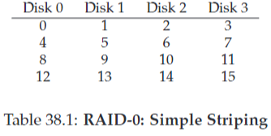
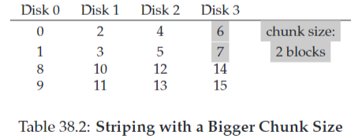
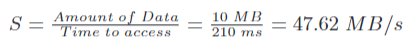
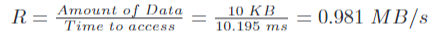
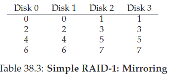
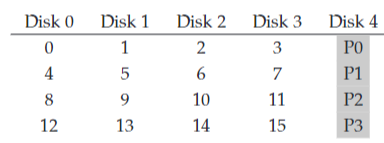
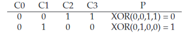
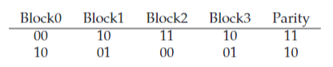
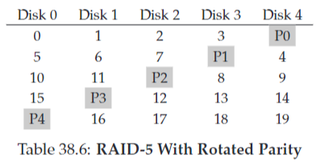
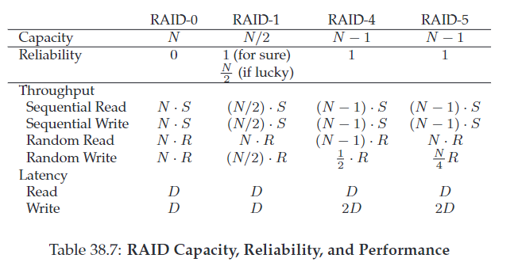

# RAIDS - Redundant Array of Inexpensive Disks

✝️ how to make a large, fast and realiable disk?

answer: using multiple disks!!!

RAIDS advantages: performance (pipeline), capacity and realiability

---

## 38.1 interface and RAID internals

when a logical I/O request arrives to the RAID, it calculates which disk(s) access and then issue the physical I/O

in a high-level, a RAID has a processo, memory and disks.
internally, its a microcontroller that runs firmware to direct RAID operations with DRAM and non-volatile RAM to buffer the memory.

---

## 38.2 fault model

knowing the kind of disk fault helps to detect and recover from a disk fault
model "fail-stop" = or it's working or it's permanently lost

---

## 38.3 how to evaluate a RAID

**capacity:** given a set of N disks, how much useful capacity is available to systems that use the RAID?

**reliability:** how many disk faults can the design tolarete?

**performance:** it depends on the workload presented

---

## 38.4 RAID level 0: Striping

there is no redundancy
stripe: blocks in the same row

as showed in this image, this is a simple striping, where there is only 1 block of info by disk and then switch it

example above of a chunk w the size of 2 blocks

**chunk sizes**
affects the performance

small chunks: increases parallelism and positioning time
big chunks: reduces parallelism and positions time

**back to raid-0 analysis**
capacity = N
reliability = any disk failures leaves to data loss
performance = all disks are used, so its excelent

**evaluating raid performance**

single-request latency: time to response to a unique read/write request

steady-state throughput: ritmo constante em que o RAID consegue lidar com muitos pedidos ao mesmo tempo, quanto está ocupadassso 🔥 (quantos dados conseguem ser entregues por segundo)

**workloads**

sequencial: 
  - large continuous chunks
  - less time seeking and roating
  - more time spend transfering data
  - S MB/s

random:
  - small sparsed chunks
  - more time seeking and rotating
  - less time transfering data
  - R MB/s

**back to raid-0 analysis**

latency is the same of a single disk

steady-state throughput we expect the full bandwidth of the disk, so its N * S and N * R

---

## 38.5 RAID level 1: mirroring

two copies per sector

read operation: chooses one of the copies
write operation: write in both places

**analysis**

capacity = N/2

reliability = 1 disk fault

performance
  - single read: like single disk
  - single write: requisres 2 parallels writes
  - steady-state throughput
    - sequential write: $(N \times S)/2$ = sequential read
    - random write = $(N \times S)/2$
    - random read = $N \times S$

---

## 38.6 raid 4: saving space with parity

parity is the attempt to use less capacity

the XOR does the trick.

with the XOR you can recover a single sector lost, by the completion.

if the quantify of 1 is odd so the result of parity columns is 1
if its even its 0

below, with chunk size bigger than 1 block, it runs for each bit of the block

**analysis**

capacity = N-1

reliability: it tolerates 1 disk failure and no more

performance
  - single read: like single disk
  - single write: requisres 2 parallels writes
  - steady-state throughput
    - sequential write: $(N-1) \times S$ (using full-stripe write)
    - sequential read: $(N-1) \times S$
    - random read = $(N - 1)\times S$
    - random write = $R / 2$
      - additive parity: read in all of the other data blocks in the stripe in parallel, write the new data and new parity to their respective disks
      - subtractive parity: read the old data the old parity, compare the old data and the new data, if thery are different filp the old parity bit 

      - small-write problem: the parity disk is unique, so requests in blocks in diff disks, relies on the same parity disk, so there is a bottleneck.

## 38.7 RAID level 5: rotating parity 

it rotates the parity block across drives

**analysis**

capacity and reliability is the same as raid 4

random read is a little better, bc we can utilize all the disks

random write performance improves noticeably, so for small writes is $(N/4)\times R$
the 4 is because the raid 5 still generates 4 total I/O operations

## 38.8 RAID comparison: a summary

