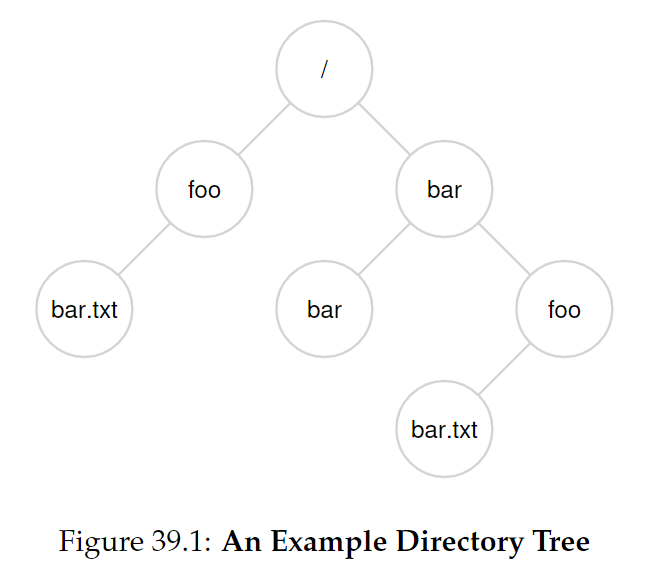

# Chapter 39 - Files and Directories

thus far, we have seen that the process (virtualization of the CPU) and the address space (virtualization of the memory).

the abstractions allow a program to run as if it is in its own private world.

in this section a new critical piece is the **persistent storage**. such as HDD and SSD.

✝️ how to manage a persistent device?

---

## 39.1 Files and Directories

### the file 📜

> its a simple linear array of bytes, each of which you can read or write. each file has some kind of **low-level name**. 

the low-level name is often referred to as its **inode number (i-number)**. 

the responsibility of the file system is simply to store such data persistently on disk and make sure that when you request the data again, you get what you put there in the first place. 

file name often has two parts, for example _bar.txt_, that has _bar_ and _txt_ separated by a period. the first part is an arbitrary name, the second indicates the type of the file.

### the directory 📂

> also has a low-level name, but its contents is a list of (user-readable name, low-level name) pairs.

for example, lets say there is a file with the low-level name "10" and with user-readable name of "foo". the dir would have an entry that maps it like ("foo", "10").

each entry in a directory refers to either files or other directories (allows directory tree / directory hierarchy).

the hierarchy starts at **root directory** (in UNIX-based) and uses some kind of **separator** to name subsequent **sub-directories** until the desired file or directory is named.



valid directories in the example are /, /foo, /bar, /bar/bar,
/bar/foo and valid files are /foo/bar.txt and /bar/foo/bar.txt.

---

## 39.2 The file System Interface

we'll start with the basics of creating, accessing and deleting files. 

along the way, we'll discover the mysterious call that is used to remove files, known as _unlink()_.

---

## 39.3 Creating Files

accomplished with the _open()_ syscall and passing the flag *O_CREAT*.

### code example

```c
  int fd = open("foo", 
                      O_CREAT|O_WRONLY|O_TRUNC, 
                      S_IRUSR|S_IWUSR);
```

the param O_CREAT creates the file **only** if it **does not exist**.

the O_WRONLY ensures that the file can only be written to 

O_TRUNC is to the case of the file already exists, truncates it to a size of zero bytes (removes it content).

### file descriptor

_open()_ returns a **file descriptor**. 

> **file descriptor def.:** is just an integers, private per process and is used in UNIX system to access files. it's a **capability**. 

it's used to read/write the file (assuming that you have permission to do so).

it's like a pointer to an object of type file.

it's managed by the OS on a per-process basis, example:

```c
  struct proc {
    ...
    struct file *ofile[NOFILE]; // open files
    ...
  }
```

---

## 39.4 