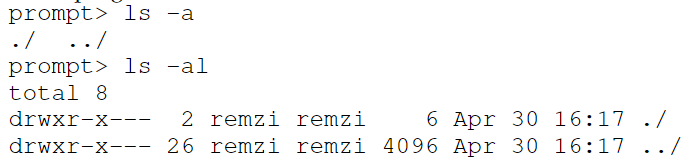

# Chapter 39 - Files and Directories

thus far, we have seen that the process (virtualization of the CPU) and the address space (virtualization of the memory).

the abstractions allow a program to run as if it is in its own private world.

in this section a new critical piece is the **persistent storage**. such as HDD and SSD.

✝️ how to manage a persistent device?

---

## 39.1 Files and Directories

### the file 📜

> its a simple linear array of bytes, each of which you can read or write. each file has some kind of **low-level name**. 

the low-level name is often referred to as its **inode number (i-number)**. 

the responsibility of the file system is simply to store such data persistently on disk and make sure that when you request the data again, you get what you put there in the first place. 

file name often has two parts, for example _bar.txt_, that has _bar_ and _txt_ separated by a period. the first part is an arbitrary name, the second indicates the type of the file.

### the directory 📂

> also has a low-level name, but its contents is a list of (user-readable name, low-level name) pairs.

for example, lets say there is a file with the low-level name "10" and with user-readable name of "foo". the dir would have an entry that maps it like ("foo", "10").

each entry in a directory refers to either files or other directories (allows directory tree / directory hierarchy).

the hierarchy starts at **root directory** (in UNIX-based) and uses some kind of **separator** to name subsequent **sub-directories** until the desired file or directory is named.


valid directories in the example are /, /foo, /bar, /bar/bar,
/bar/foo and valid files are /foo/bar.txt and /bar/foo/bar.txt.

---

## 39.2 The file System Interface

we'll start with the basics of creating, accessing and deleting files. 

along the way, we'll discover the mysterious call that is used to remove files, known as _unlink()_.

---

## 39.3 Creating Files

accomplished with the _open()_ syscall and passing the flag *O_CREAT*.

### code example

```c
  int fd = open("foo", 
                      O_CREAT|O_WRONLY|O_TRUNC, 
                      S_IRUSR|S_IWUSR);
```

the param O_CREAT creates the file **only** if it **does not exist**.

the O_WRONLY ensures that the file can only be written to 

O_TRUNC is to the case of the file already exists, truncates it to a size of zero bytes (removes it content).

### file descriptor

_open()_ returns a **file descriptor**. 

> **file descriptor def.:** is just an integers, private per process and is used in UNIX system to access files. it's a **capability**. 

it's used to read/write the file (assuming that you have permission to do so).

it's like a pointer to an object of type file.

it's managed by the OS on a per-process basis, example:

```c
  struct proc {
    ...
    struct file *ofile[NOFILE]; // open files
    ...
  }
```

---

## 39.4 Reading and Writing Files

```cmdline
  prompt> echo hello > foo
  prompt> cat foo
  hello
  prompt>
```

in this code we redirect the output of the program _echo_ to the file _foo_, which contains "hello".

we then use _cat_ to sse the content of the file.

> how the _cat_ access the file _foo_?

we can use _strace_ command to check this, by tracing the system calls made by a program.

```cmdline
  prompt> strace cat foo
  ...
  open("foo", O_RDONLY|O_LARGEFILE) = 3
  read(3, "hello\n", 4096) = 6
  write(1, "hello\n", 6) = 6
  hello
  read(3, "", 4096) = 0
  close(3) = 0
  ...
  prompt>
```

### open

the first thing that it does is open the file for reading. the flag *O_RDONLY* indicates that the file is opened only for reading. the *O_LARGEFILE* indicates that the 64-bit offset is used. the call _open()_ succeeds and returns a file descriptor, which has value of 3.

> why does the first call to _open()_ returns 3?

this is because the file descriptor 0, 1 and 2 are respectively to the files: standard input, standard output and standard error.

### *read()*

- 1st argument: file descriptor
- 2nd argument: buffer where the result will be placed*
- 3rd argument: the fize of the buffer 

the call returns successfully returning the number of bytes it read.

*: (in the strace result, it shows the results of the read as "hello\n")

### *write()*

a single call to the file descriptor 1 (std out).

is used to write the "hello" to the screen as the _cat_ is meant to do.

maybe _cat_ can call the routine _printf()_ instead of _write()_, which figures out all the formatting details passed to it.

### *close()*

when the read returns 0 the program knows that the file is entirely read, so it calls _close()_.

> ✝️ each process maintainas an array of file descriptor, each of which refers to an entry in the system-wide **open file table**. each entry tracks which underlying file the descriptor refers to, the current offset, and other details such is readable or writable.

---

## 39.5 Reading and Writing, but Not Sequentially

sometimes, it is useful to be able to read or write to a specific offset within a file. 

if you build an index over a text document, and use it to look up a specific word, you may end up reading from some random offsets.

```
  off_t lseek(int fildes, off_t offset, int whence);
```

this functions just aims to changes a variable in OS memory that tracks, for a particular process, at which offset its next r/w will start

the first argument is a file descriptor, the second is the offset and the third is for historical reasons (determines exactly how the seek is performed).

_whence_ cases:
- SEEK_SET: the offset is set to offset bytes
- SEEK_CUR: the offset is set to its current location plus offset bytes.
- SEEK_END: the offset is set to the size of the file plus offset bytes.

ways to update the offset;
- when a read or write of _N_ bytes takes place, then offset = offset + _N_
- explicity with _lseek_

example of file struct:

```c
  struct file {
    int ref;
    char readable;
    char writable;
    struct inode *ip;
    uint off; //offset
  };
```

all the currently opened files in the system together are referred to as the **open file table**.  

```c
  struct {
    struct spinlock lock;
    struct file file[NFILE];
  } ftable;
```

### examples

#### reading a file of 300 bytes


important things to note:
- offset is initialized to zero
- offset is incremented by each _read()_ 
- returns zero from _read()_ when the file is entirely read

##### reading the same file twice


two file descriptors are allocated (3 and 4) and each refers to a different entry in the open file table (OFT). in the imagem OFT[10] and OFT[11] refers to the entries of the files

#### *lseek()*
process uses _lseek()_ to reposition the current offset before reading


here _lseek()_ call first sets the current offset to 200, the subsequent _read()_ then reads the next 50 bytes and updates the current offset accordingly.

---

## 39.6 Shared File Table Entries: *fork()* and *dup()*

each logical reading/writing of a file is independent, and each has its own current offset while it accesses the given file.

however, there are a few interesting cases where an entry in the open file table is _shared_. 

### *fork()*

one of those cases occurs when a parent process creates a child process with _fork()_.


in this code, a parent creates a child and then waits for it to complete. the child adjusts the current offset via a call to _lseek()_ and then exits. finally the parent checks the current offset and prints out its value.

this is the output of the code 👇


this show the relationships that connect: each process's private descriptor array, the shared OFT entry and the reference from it to the underlying file-system inode. 


first use of **reference count** here.  when a file table entry is shared, its refcount is incremented and only when both processes close the file will the entry be removed.

sharing open file table entries across parent and child is useful, if you create a number of processes that are cooperatively working on a task, they can write to the same output file.

### *dup()*

one other case of sharing OFTE is with the use of _dup()_ system call.

allows a process to create a new file descriptor that refers to the same underlying open file as an existing descriptor.

code example

```c
  int main(int argc, char *argv[]) {
    int fd = open("README", O_RDONLY);
    assert(fd >= 0);
    int fd2 = dup(fd);
    // now fd and fd2 can be used interchangeably
    return 0;
  }
```

this is useful when writing a UNIX shell and performing operations like output redirection.

---

## 39.7 Writing Immediately with *fsync()*

the file system, for performance reasons, will **buffer** such writes in memory for some time and then write after this timestamp.

from the perspective of the calling application, writes is quickly completed and only in rare cases will data be lost.

for a DBMS, development of a correct recovery protocol requires the ability to force writes to disk from time to time.

to support these, the API provide the _fsync(int fd)_.

this call makes the file system responds by forcing all **dirty** data to disk for the file specified.

code snippet:
```c
  int fd = open("foo", O_CREAT|O_WRONLY|O_TRUNC, S_IRUSR|S_IWUSR); // opens the file
  assert(fd > -1);
  int rc = write(fd, buffer, size);
  assert(rc == size);
  rc = fsync(fd);
  assert(rc == 0);
```

sometimes, its also necessary to _fsync()_ the directory that contains the file _foo_. adding this ensures not only that the file itself is on disk, but that the file, if newly created, also is durably a part of the directory.

---

## 39.8 Renaming Files

it is useful to be able to give a file a different name.

```cmdline
  prompt> mv foo bar
```

using _strace_ we can see that _mv_ uses _rename(char *old, char *new)_ syscall.

one interesting guarantee provided by this syscall is that is implemented as an **atomic** call. if the system crashes during the renaming, the file will either be named the old name or the new name, and no odd in-between.

example of a file ensuring that the new file = original content + line inserted. 

```c
  int fd = open("foo.txt.tmp", O_WRONLY|O_CREAT|O_TRUNC, S_IRUSR|S_IWUSR);
  write(fd, buffer, size); // write out new version of file
  fsync(fd);
  close(fd);
  rename("foo.txt.tmp", "foo.txt");
```

the editor writes out the new version of the file under a temporary name, force it to disk and when the app is certaing that the new file metadata and contents are on the disk, rename the temporary file to the original file's name.

---

## 39.9 Getting Information About Files

metadata of the files.

system calls: _stat()_ or _fstat()_.

these calls take a pathname to a file and fill in a _stat_ structure as seen in the fig below.


example of infos about a file:
- size (bytes)
- low-level name (inode number)
- ownership information
- info about when the file was accessed or modified
- ...


each file system keeps this type of info in a structure called an **inode**. for now, this is an persistent data structure kept by the file system that has info like we see above.

---

## 39.10 Removing Files

> what system call does _rm_ use to remove a file?

using _strace_ we see:


it just takes the name of the file to be removed and returns zero upon success. 

but... why unlink? why not delete or remove?

---

## 39.11 Making Directories

you can never write to a directory, because it is considered file system metadata.

to create a directory, a single system call _mkdir()_ is available. 


when such dir is created, it is considered "empty", although it does have a bare minimum of contents. it has two entries: one that refers to itself and other that refers to its parent.

the former is reffered to as the "." (dot) and the latter as ".." (dot-dot). you can see it by passing a flag (-a) to the _ls_ cmdline.



---

## 39.12 Reading Directories

this is exactly what the program _ls_ does.

below is an example program that prints the contents of a directory. 
it uses three calls: _opendir()_, _readdir()_ and _closedir()_.

```c
  int main(int argc, char *argv[]) {
    DIR *dp = opendir(".");
    assert(dp != NULL);
    struct dirent *d;
    while ((d = readdir(dp)) != NULL) {
    printf("%lu %s\n", (unsigned long) d->d_ino,
    d->d_name);
    }
    closedir(dp);
    return 0;
  }
```

directory entry structure:
```c
  struct dirent {
    char d_name[256]; // filename
    ino_t d_ino; // inode number
    off_t d_off; // offset to the next dirent
    unsigned short d_reclen; // length of this record
    unsigned char d_type; // type of file
  };
```

---

## 39.13 Deleting Directories

you can delete a dir with a call to _rmdir()_ (which is used by the program of the same name, _rmdir_).

rmdir has the requirement that the directory is empty.

---

## 39.14 Hard Links

now we will understand why deleting a file results in a _unlink()_ call.

another way to make an entry in the file system tree is by _link()_.

the _link()_ takes two args, an old pathname and a new one.

you basically create another way to refer to the same file.

the cmdline _ln_ is used to do this, like in the example:

```cmdline
  prompt> echo hello > file
  prompt> cat file
  hello
  prompt> ln file file2
  prompt> cat file2
  hello
```
 
it simply creates another name in the directory you are creating the link to, and refers it to the same inoed number of the original file.

the file is **not** copied in any way, rather, you now just have two human-readable names that refer to the same file.

passing _-i_ as a flag to _ls_ will print the inode number of each file (as well the file name).

```cmdline
  prompt> ls -i file file2
  67158084 file
  67158084 file2
  prompt>
```

#### what really happens when you create a file..

first, you are making a structure (inode) that will track virtually all relevant information about the file.

second, you are _linking_ a human-readabele name to that file, and putting that link into a directory.

#### why *unlink()*?

if we just _rm_ a file, the links that it has will remain up, like here:

```cmdline
  prompt> rm file
  removed ‘file’
  prompt> cat file2
  hello
```

when we unlink the file, it checks the **reference count** of it, this allows the file system to track how manu diff file names have been linked to this inode.

only when ref count reaches zero it stops.

you can check the ref count using _stat()_, example:


---

## 39.15 Symbolic Links

there is one other type of link called **symbolic link/soft link**.
you cant create a link to a directory with a hard link, either you cant hard link to files in other disk partitions. 

you can create by using _ln -s_.

```cmdline
  prompt> echo hello > file
  prompt> ln -s file file2
  prompt> cat file2
  hello
```

#### differences between the hard and the soft 😏

- **1st**: a symbolic link is actually a file itself, of a different type.

```cmdline
  prompt> stat file
  ... regular file ...
  prompt> stat file2
  ... symbolic link ...
```

ls also reveals it. the first char is a _"l"_ (regular files is _"-"_ | directories is _"d"_)

```cmdline
  prompt> ls -al
  drwxr-x--- 2 remzi remzi 29 May 3 19:10 ./
  drwxr-x--- 27 remzi remzi 4096 May 3 15:14 ../
  -rw-r----- 1 remzi remzi 6 May 3 19:10 file
  lrwxrwxrwx 1 remzi remzi 4 May 3 19:10 file2 -> file
```

the length of the soft link relies on the pathname length.

#### dangling reference

```cmdline
  prompt> echo hello > file
  prompt> ln -s file file2
  prompt> cat file2
  hello
  prompt> rm file
  prompt> cat file2
  cat: file2: No such file or directory
```

---

## 39.16 Permission Bits and Access Control Lists

how the files and directories are shared among users, it needs to have some **permission bits**.

example with the foo.txt:

```cmdline
  prompt> ls -l foo.txt
  -rw-r--r-- 1 remzi wheel 0 Aug 24 16:29 foo.txt
```

it has basically three parts:
- owner
- group
- other

each part has its permission (r-ead w-rite e-xecute)

in the output above, the group is the _wheel_.

#### file mode

the owner can change these permissions with _chmod_ command (changing the file mode).

example:
```cmdline
  prompt> chmod 600 foo.txt
```

this command enables the readable bit (4) and writable bit (2) and (OR'ing thm yields the 6 above).

so the command above set 6 for the owner and 0 to group and others.

#### directories

the exec permissions is different, it enables a user to do things like change directories (_cd_) and, with the combination of writable bit, to create files therein.

#### AFS 

its a file system, that does this in the form of an Access Control List (ACL) per directory. 

this allows to create a very specific list of permissions.

example of the access controls for a private directory in one author's AFS account:

```cmdline
  prompt> fs listacl private
  Access list for private is
  Normal rights:
  system:administrators rlidwka
  remzi rlidwka
```

---

## 39.17 Making and Mounting a File System

> how to assemble a full directory tree from many underlying file systems?

this is done via making a file systems and then mounting them to make their contents accessible.

most file systems provides the tool _mkfs_ that performs this task.

give a devide (as input), such as a disk partition /my/path/to/fs, and a file system type, e.g. ext3, and it simply writes an empty file system.

once such file system is created, it needs to be made accessible within the uniform file-system tree. this is done via _mount()_.

mount quite simply takes an existing directory as a target **mount point** and essentially paste a new file system onto the dir tree at that point.

#### example

we have an unmounted ext3 file system, stored in device partition _/dev/sda1_, that has a root dir which contains two sub-directories _a_ and _b_, that both holds a single file named _foo_. 

if we want to mount this at the mount point _/home/users_ we would type something like this:

```cmdline
  prompt> mount -t ext3 /dev/sda1 /home/users
```

if successfull, the mount would thus make this new file system available. now it's acesssed like this:

```cmdline
  prompt> ls /home/users/
  a b
```

now _/home/users/_ refers to the root of the newly-mounted directory.

instead of having a number of separate file systems, mount unifies all file systems into one tree, making naming uniform and convenient.

---

## key terms

