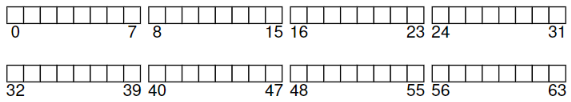
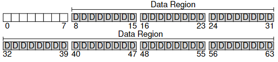
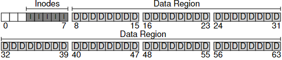
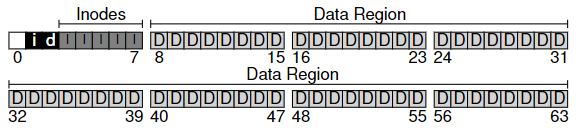
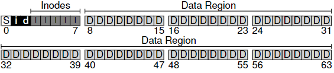
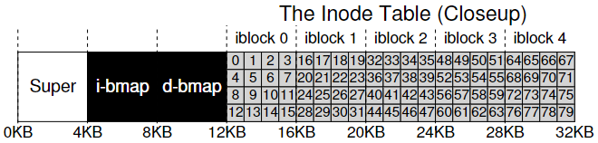
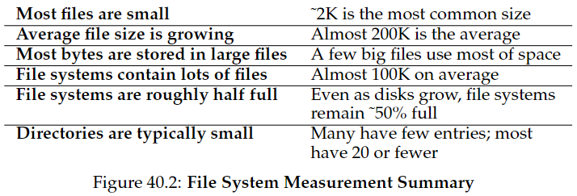
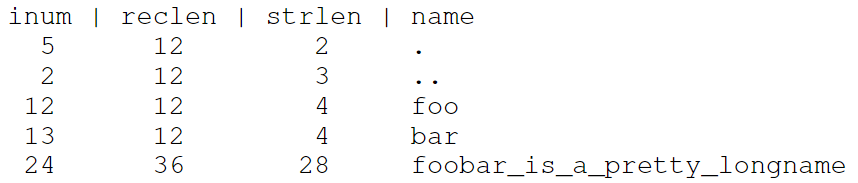
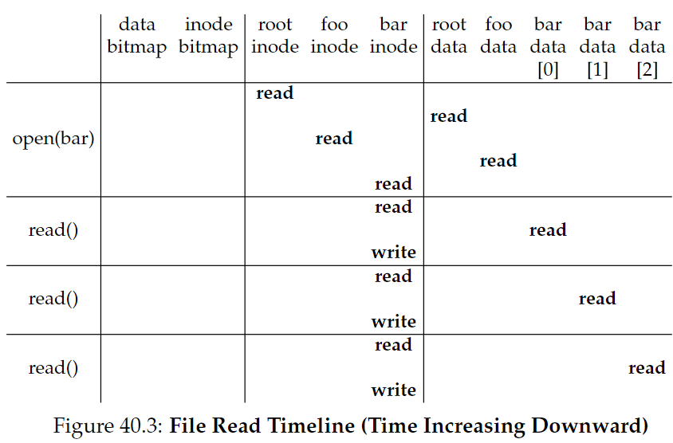
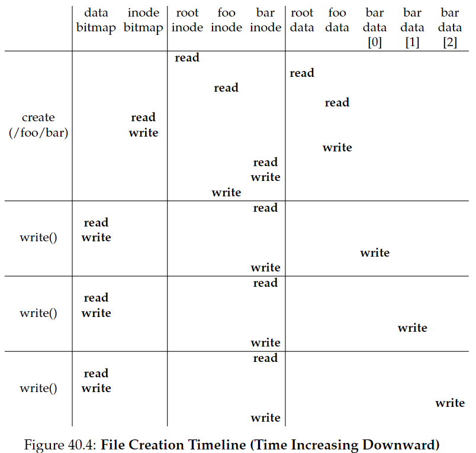

# Chapter 40 - File System Implementation

we will introduce a simple file system, know as **vsfs** (the **Very Simple File System**). this is a simplified version of a typical UNIX file system and thus serves to introduce some of the basic on-disk structures, access methods and policies.

the file system is pure software.

> ✝️ how to implement a simple file system? how can we build one, what structures are needed on the disk, what do they need to track? how are they accessed?

## 40.1 The Way to Think

has two mains aspects
- **data structures**: what types of on-disk structures are utilized to organize data and metadata?

- **access methods**: how does it map the calls made by a process, such as _open()_, _read()_, _write()_ ...? which structures are read during the execution of a particular syscall? which are written? how efficiently are all of these steps performed?

## 40.2 Overall Organization

the first thing we'll need to do is divide the disk into **blocks**. simple fs use just one block size, we can choose 4KB.

in a partition of size N 4-KB blocks and with just 64 blocks, we have this:

### what do we need to store in these blocks to build a fs?

the 1st thing is user data (in fact, most of the space is destinated to this). we will call this **data region**.

we will reserve a fixed portion for these blocks, like this:

the fs has to track info about each file, this is a key piece of **metadata**, and tracks:
- which data blocks comprise the file
- the size of the file
- its owner
- access rights
- access and modify times
- ...

to store all this, fs uses the **inode** (welcome back yeey).

we will have an **inode table** to stores the inodes, which occupy a fix size, like this:

its missing the **allocation structures**, that supports the track whether inodes or data blocks are free or allocated. 

for that, we can use a **free list** that points to the first free block, which points to the next...

remzi chosed the simple **bitmap**, one for the data region (**data bitmap**) and one for the inode table (**inode bitmap**).

a bitmap is a simple structure: each bit is used to indicate whether its free (0) or in-use (1). now look the new layout of the disk;

the last block is for the **superblock**. it contains info about this particular file system, including, how many inodes and data blocks are in the file system, where the inode table begins, a magic number to identify the file system type and etc..

## 40.3 File Organization: the Inode

inode means **index node**. the inode number is used to index into an array of on-disk inodes in order to find the inode of that number.

each inode is implicity referred to by a number (**i-number**), which we've called of low-level name (chapter 39). 

in VSFS given an i-number, you should directly be able to calculate where on the disk the corresponding inode is located. 

example: reading inode number 32. first calculate the offset (32 . _sizeof(inode)_ = 8192), add it to the start address (_inodeStartAddr_ = 12 KB), and thus arrive upon the correct byte address of the desired block of inodes: 20 KB.

disks are not addressable, but it consist of a large number of addressable sector, usually 512 bytes. so the sector address _sector_ of the inode block can be calculated as follows

> blk = (inumber * sizeof(inode_t)) / blockSize;
> sector = ((blk * blockSize) + inodeStartAddr) / sectorSize;

inside each inode is virtually all the info you need about a file:
- _type_ (regular file, directory, soft link ...)
- _size_
- number of _blocks_ allocated
- _protection information_ (who owns the file, who can access it)
- _time_ information (when was created, modified or last accessed)
- info about where its data blocks reside on disk

(all this is **metadata**)

> how the inode refers to where its data blocks are?

it can has **direct pointers** inside the inode, each pointer refers to one disk block that belongs to the file. this limits the size of the file to not be bigger than the block size multiplied by the number of direct pointers in the inode.

### The Multi-Level Index

> 🔥 REVISAR 🔥

to support bigger files, one idea is the **indirect pointer**. 

it points to a block that contains more pointers, each of which point to user data.

if a file grows large enough, an indirect block is allocated.

ask in the class about it (yey)

> ✝️ extent is simply a disk pointer plus a length (in blocks); thus, instead of requiring a pointer for every block of a file, all one needs is a pointer and a length to specify the on-disk location of a file

to support even larger files, adds the **double indirect pointer** to the inode structure.

overall, this imbalanced tree is referred to as the **multi-level index** approach to pointing to file blocks. 

other way is to use the linked list.

## 40.4 Directory Organization

a directory basically just contains a list of pair (entry name, inode number).

example: assume a _dir_ (inode number 5) has three files in it (_foo_, _bar_ and *foobar_is_a_pretty_longname*) with inode numbers 12, 13 and 14. the on-disk data look like: 

each entry has:
- inode number
- record lenght (total bytes for the name + left over space)
- string length (just the name lenght)
- the name

**deleting** a file would left an empty space in the dir, so should exist a way to mark this.

after a delete, a new entry can reuse one past-deleted entry, for this be possible, the record lenght is used.

> where the directories are stored?

file systems treat dir as a special type of file. thus it has an inode in the inode table. the dir has data blocks pointed to by the inode that lives in the data blocks region.

> ✝️ free space management.
> bitmaps are just one way, there is the old **free lists**, where a single pointer in the super block was kept to point to the first free block. modern fs use more sophisticated data structures, like a **B-tree**.

## 40.5 Free Space Management

a _fs_ must track which inodes and data blocks are free (and are not free).

in _vsfs_ we have two simple bitmaps for this task.

when we create a file, the _fs_ search trough the bitmap for an inode that is free and allocate it to the file. then it mark the inode as used (with a 1) and eventually update the on-disk bitmap.

**pre-allocation** policies can be used, like in some Linux _fs_ that searchs a sequence of blocks to allocate to a new file, bc with a sequence of blocks there is more chance to the file has contignous blocks (improving performance).

## 40.6 Access Paths: Reading and Writing

> 🚨 for the following examples, let us assume that the fs has been mounted and thus that the superblock is already in memory. everything else (nodes and directories) is still on the disk 🚨

### reading a file from disk

first, assume that you want to open the file (*/foo/bar*), read it and close it, beyond that, the file is just 12KB (3 blocks).

#### *open()*

when issue a *open("/foo/bar", O RDONLY)*, the _fs_ first need to find the inode for the file _bar_. so it must **traverse** the pathname and thus locate it.

all traversals beging at the **root directory** ("/"). so first is necessary the inode of the root dir. to find it, its needed the i-number (which is usually located in its parent dir, but the root doesnt have it). so the FS must know the i-number of the root.

once the inode is read, FS can look to find pointers to data blocks, which has the root contents.

FS uses the on-disk pointers (looking for an entry _foo_).

once found the _foo_ entry, FS will also have found the inode number of _foo_ which will be read.

and then this occurs recursively, until the _bar_ is found in the directory data of _foo_.

the final step is to read _bar's_ inode into memory and for that is done a permission check. after that, allocates a file descriptor for this process in the per-process open-file table and returns it to the user.

#### *read()*

once open, the program issues a _read()_. the first read (offset is 0, unless _lseek()_ has been called) will thus read in the first block, consulting the inode to find the location. 

this can update the "last accessed time" of the inode at open-file table. the read updates too the offset of the file.

at some point, the file will be closed. 

timeline of the read process:

### writing a file to disk

first, the file must be opened (as above).

then the app issue a _write()_ to update the file with new contents. finally, the file is closed.

writing may cause in **allocatin** a new block. 

each write to a file logically generates five I/Os:
- read the data bitmap 
- write the bitmap (reflect its new state to disk)
- read inode
- write inode
- write the actual block itfself

to create a file, the FS must allocate an inode AND space within the directory containing the new file

I/O traffic to it:
- one read to the inode bitmap (find a free inode)
- write to the inode bitmap (mark it allocated)
- write to the new inode itself (initialize it)
- write the data of the dir (maps high-level name to inode number)
- read to the dir inode
- write to the dir inode (update it)

if the directory needs to grow, additional I/Os will be needed.

#### specific example

creating the file _/foo/bar_ and three blocks are written to it.

this fig shows what happens during the _open()_ (which creates the file) and during the three 4KB writes:

> ✝️ how to reduce file system I/O costs?

## 40.7 Caching and Buffering

most FS uses system memory (DRAM) to cache important blocks.

early systems introduced a **fixed-size cache** to hold popular blocks. strategies like LRU could be used.

the **static partitioning** can be wasteful, for example, the case of the FS doesnt need 10% of memory at a given point in time. unused pages in the file cache cant be re-purposed for some other use.

modern systems, employ **dynamic partitioning**. unions virtual memory pages and file systems pages into a **unified page cache**.

#### caching for reads are great, but for writes..

a cache does not serve, so **write buffering** improves the performance.

by buffering, the system can **schedule** the I/Os.

resume of benefits: it avoids uncessary writes
- created and deleted right after
- inode bitmap updated when file is created and then updated moments later

#### problems

if there's a system crash, then all buffered is lost.

some application, like databases, dont buffer that much.

to avoid unexpected data loss, they force the write (like _fsync()_).

using **direct I/O** or **raw disk** is an alternative.