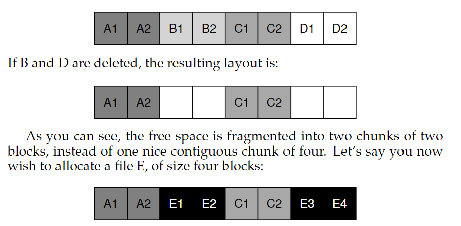
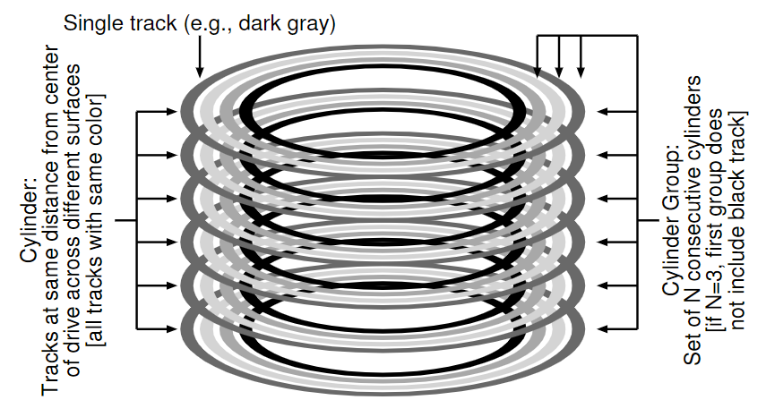
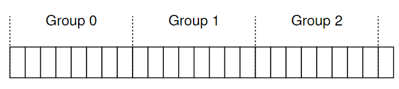
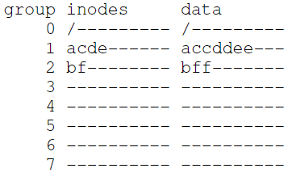
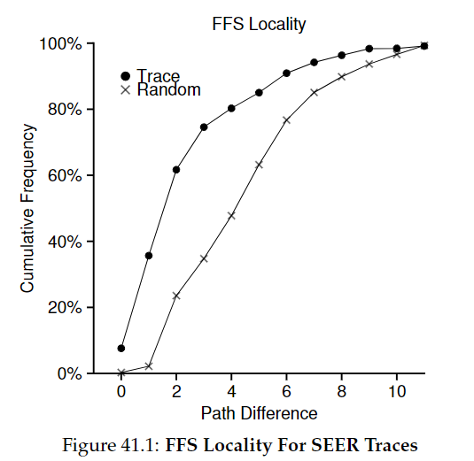
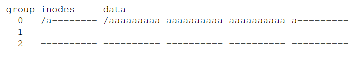
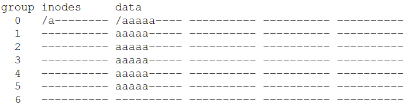
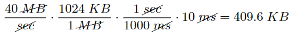
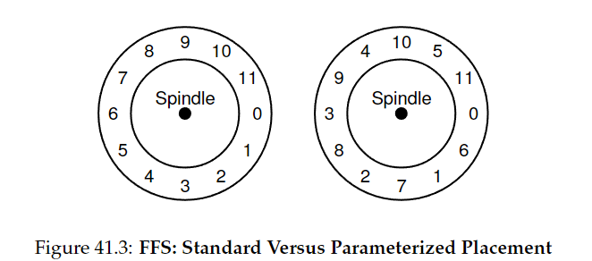

# Chapter 41 - Locality and the Fast File System

the old UNIX file system was simple and like this on the disk:

the super block (S) contained the following infos:
- how big the volume is
- how many inodes there are
- a pointer to the head of a free list of blocks

the inode region contained all the inodes.

most of the disk was taken up by data blocks.

this old FS was simple and supported the basics abstractions: files and the directory hierarchy.

## 41.1 The Problem: Poor Performance

the FS delivered only 2% of overall disk bandwidht 😢

> **main issue**: it treated the disk like it was a random-access memory.

the data blocks of a file were very far away from its inode (expensive seek).

worse, the FS would end up quite **fragmented**. the free list pointed to a bunch of blocks spread across the disk, it just simply take the next free block for to be allocated.

example: data block region with four files (A, B, C and D) each with 2 blocks-size.

now you dont have sequential performance for E.

this problem (fragmentation) is exactly what **defragmentation** tools help with.

--- 

## 41.2 FFS: Disk Awareness is the Solution

the **Fast File System (FFS)** keep the same _interface_ (including _open()_, _read()_, _write()_, _close()_ ...) but changing the internal *implementation*.

--- 

## 41.3 Organizing Structure: the Cylinder Group

FFS divides the disk into a number of **cylinder groups**.

a single **cylinder** is a set of tracks on different surfaces of a hard drive that are the same distance from the center of the drive.

FFS aggregatas _N_ consecutive cylinders into a group.

example showing the four outer most tracks of a drive with six plattters and a cylinder group that consists of three cylinders:

organize the drive into **block groups**, each of which is just a consecutive portion of the disk's address space.

placing two files within the same group, FFS can ensure that accessing one after the other wont result in long seeks across the disk.

FFS needs to place files and directories into a group and track all info needed.

what FFS keeps within a single cylinder group:

FFS keeps a copy of S into each group for reliability reasons.

FFS track whether the inodes and data blocks of the group are allocated, so the **inode bitmap** (id) and **data bitmap** (db) serve this role.

the rest is like on _vsfs_.

--- 

## 41.4 Policies: How to Allocate Files and Directories

> **mantra**: *keep related stuftt together*

FFS has to decide that is "related". to do this, FFS make use of a few **placement heuristics**:

**to directories**: find the cylinder group with a low number of allocated diretories and a high number of free inodes and put the directory data and inode in that group.

**to files**:
- makes sure to allocate the data blocks of a file in the same group as its inode (preventing long seeks between inode and data)

- it places all files that are in the same directory in the cylinder group of the directory there are in.

### example

assume that there are only 10 inodes and 10 data blocks in each group, and that are three directories ("*/*", "*/a*" and "*/b*") and four files (*/a/c*, */a/d*, */a/e*, */b/f*) placed per FFS policies.

assume that the regular files are each two blocks in size and the directories have just a single block of data.

the data blocks of each file are near each file's inode.

files in the same directory are near one another (*/a/c*, */a/d*, */a/e* are all in group1)

--- 

## 41.5 Measuring File Locality

its used SEER traces and analyze how "far away" file accesses were from one another in the directory tree.

> "if file *f* is opened, and then re-opened next in the trace (before any other files are opened), the distance between these two opens in the directory tree is zero (as they are the same file). If a file *f* in directory dir (i.e., *dir/f*) is opened, and followed by an open of file g in the same directory (i.e., *dir/g*), the distance between the two file accesses is one"

this graph plost the difference metric along the x-asis and shows the cumulative percentage of file open that were of that difference along the y-axis. 

its notable that about 7% of file accesses were to the file that was opened previously and that 40% of file accesses were to either the same file or to one in the same directory.

the graph also shows locality for a "random" trace, that was generated by seelcting files from within an existing SEER trace in random order.

---

## 41.6 The Large-File Exception

a large file would entirely fill the block group it is first placed within, and this is undesirable (prevents "related" files from beign placed wihin this block group).

what FFS does: after some blocks are allocated into the first block group, FFS places the next large chunk f the file in another block group recursevely.

without the large-file exception would be like this with a file "_/a_" with 30 blocks in a FFS with 10 inodes and 40 data blocks:

but with the LFE would be like this:

this affects performance, so the chunk size must be selected carefully. this process of reducing an overhead by doing more work per overhead paid is **amortization**.

#### example

average positioning time = 10ms.
disk transfer data at 40 MB/s.

if you want to spend half of time seeking and half of time transferring data, thus you need to spend 10ms transf data for every 10ms positioning, how big the chunk must be to spend 10ms in transfer?

if you transfer data at 40 MB/s, you need to trasnfer 409.6KB every time you seek in order to spend half of time seeking/transfering.

simarly if you want to achieve 90% of bandwidth the chunk must be 3.6MB (for 99% is 39.6MB of chunk size).

----

## 41.7 A Few Other Things About FFS

### sub-blocks 

many files were 2KB, but using 4KB blocks causes **internal fragmentation** (half of the disk beign wasted!!!).

to solve this, there are the **sub-blocks**, which were 512-byte blocks.

as the file grew, the FS will continue allocating 512-byte blocks to until it acquires a full 4KB of data and then copy it to a full 4KB block and free the sub-blocks.

this is not performatic!! thus FFS avoided this behavior modifying the _libc_ library. so the writes would be buffered until it reaches 4KB chunks (avoiding sub-blocks).

### disk layout optimized for performance

in those times, CPU had to control the disk operationgs in a more "hands-on way". 

a problem arose in FFS when a file was placed on consectuvie sectors of  the disk, like here:

the problem arose during sequential reads.

example: FFS issue a read to block 0. by the time the read was completed, and FFS issuses a read to block 1 but it was too late and then would incur a full rotation.

FFS solved this by skipping over every other block, in fact, FFS can calculate how many blocks it should skip to avoid extra rotations (this is called **parameterization**).

> ask why the head pass trought 1, i think that it ends exactly at 1 after reading 0

doing this you only get 50% of peak bandwidth, because you have to go around each track twice just to read each block once.

moderns disk actually read the entire track in and buffer it (called **track buffer**). 

### other things

FFS was on of the first FS to allows long file names.

**symbolic link** was created because hard links are limited by that it cant point to directories and they can only point to files within the same volume, so the symbolic links allows the user to create an "alias" to any other file/dir.

FFS also introduced _rename()_ operation.

