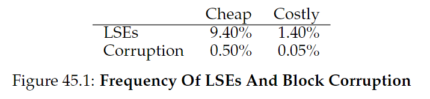
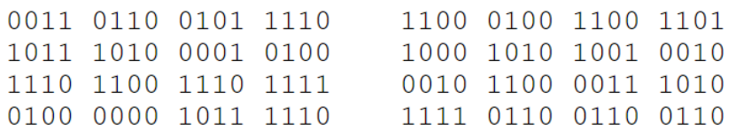
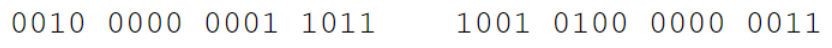
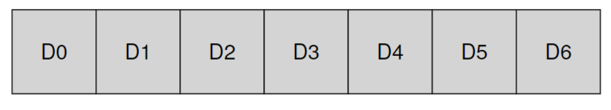
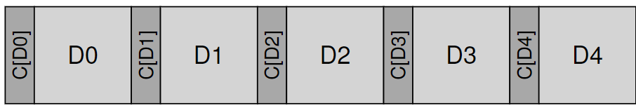
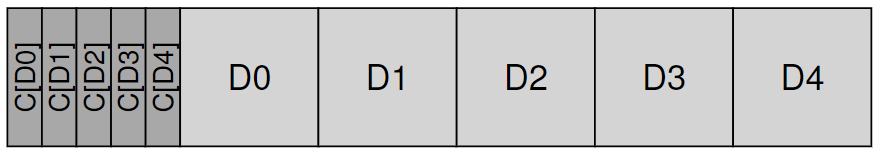
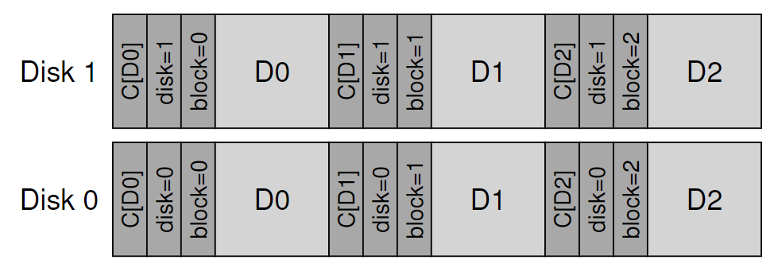

# Chapter 45 - Data Integrity and Protection

in this chapter, we focus on reliability.

how should a file system or storage system ensure that data is safe, given the unreliable nature of modern storage devices?

> ✝️ how to ensure data integrity?

## 45.1 Disk Failure Modes

in early RAID systems was: either the entire disk is working, or it fails completely.

the **fail-stop** model facilitates the building of RAID.

two types of single-block failures are common:
- **latent sector erros (LSEs)**
- **block curruption**

### LSEs

arises when a disk sector has been damaged.

a **head crash** can happen (head touches the disk).

a cosmic ray can flip bits, fortunately in-disk **error correcting codes (ECC)** are used by the drive to determine whether the on-disk bits in a block are good and sometimes how to fix it too.

### Corruption

theres cases where a disk block becomes corrupt in a "not-visable" way, like with wrong content, and this is called **silent faults**.

how rare these types of faults are?

### Additional findings

LSEs
- costly drives with more than one LSE are as likely to develop aditional errors as cheper drives
- aanual error rate increases in year two
- the number of LSEs increase with disk size
- most disks with LSEs have less than 50
 
Corruption
- chance of corruption varies grealy acrross differente drive models within the same drive class
- age effects are different across models
- workload and disk size have little impact

---

## 45.2 Handling Latent Sector Erros

when a storage system tries to access a block and the disk returns an error, so its easy to know.

in a mirrored RAID, the system should access the alternate copy and recover the faulted block.

when a **reconstruction** is beign made and an LSE is encountered, we cant successfully complete the process. to combat this, some systems add an extra degree of redundancy (other parity disk).

---

## 45.3 Detecting Corruption: the Checksum

the _detection_ is a key problem.

the primary mechanism is **checksum**. its a result of a function that takes a chunk of data as input. the goal it to enable a system to detect if data has somehow been corrupted or altered by storing the ckecksum with the data.

### common checksum functions

> "there is no such thing as a free lunch"

is made a trade-off between strenght (how good the protection is made) and speed (how quickly can they be computed).

one simple way is by using XOR function. its computed by XOR'ing each chunk of the data block beign checksummed. 

example of data block:

XOR each column:

another basic checksum is addition. its fast.

more complex algorithm is **Fletcher checksum**. detecting all single-bit, double-bit errors and many burst errors.

how it works? assume a block D consists of bytes d~1~ ... d~n~; s~1~ is defined as follows: s~1~ = (s~1~ + d~i~) mod 255 (computed over all d~i~); s~2~ in turn is: s~2~ = (s~2~ + s~1~) mod 255 (again over all d~i~).

the final commonly-used checksum is the **Cyclic Redundancy Check (CRC)**. assume that you wish to compute the checksum over a data block D, so you treat is as a large binary number and divide it by an value _k_. the remainder of the divider is the value of CRC. 

one common problem in checksum is **collision**, where two different data blocks generates the same checksum.

### checksum layout

how should checksum be stored on disk?

basic approach: stores a checksum with each disk sector (block). given a data block _D_, without checksum the layout is this:

but with checksum is like this:

how checksums are small and disk can only write in sector-sized chunks, the layout above is hard to achieve.

one way is to format the drive with 520-byte sector (extra 8-byte for checksum)

without this functiontality, there is one possibility:

---

## 45.4 Using Checksums

when reading a block _D_, the cliente also reads the **stored checksum** (_C~s~_), then the cliente computes the checksum over _D_ and gets the **computed checksum** (_C~c~_).

if they are equal, its all right!

given a corruption, if there is a copy, try to use it. if not, cry! (cry and return an error)

---

## 45.5 A New Problem: Misdirected Writes

when a write is done correctly but in the wrong location (it can write at wrong disk too).

adding a **physical identifier (physical ID)** to the checksum.

now it will store the disk and sector number of the block, so if a misdirected write happen, its easy to notice.

layout updated:

---

## 45.6 One Last Problem: Lost Writes

occurs when the device informs the upper layer that a write has completed but in fact it never is persisted.

one classic solution is **write verify** or **read-after-write**.

some systems add a checksum to detect lost writes.

**Zettabyte File System (ZFS)** does includes a checksum in each file system inode and indirect block for every block included within a file.

---

## 45.7 Scrubbing 

because there are a lot of data that is not accessed periodically, the OS must take care of that data.

many systems utilize **disk scrubbing**, by periodically reading through _every_ block of the system and checking if the checksum is valid.

---

## 45.8 Overheads of Checksumming

#### space overhead

- **1st**: on the disk. checksum takes place of data. 
- **2nd**: in the memory of the system. must now be room in memory for the checksums as well as the data. if the system throws the checksum after reading it, thats not a big deal.

#### time overhead

the must CPU must compute the checksum over each block, when it is stored and accessed.

one approach to reduce it, is to combine data copying and checksumming into one streamlined activity (the copy is needed anyhow, e.g copying from kernel cache to user buffer).

#### I/O overhead

some checksumming schemes can induce extra I/O instructions, particularly when checksums are stored distinctly from the data
