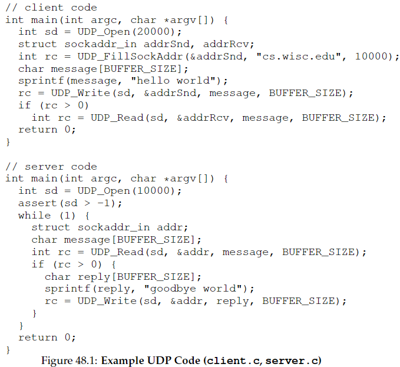
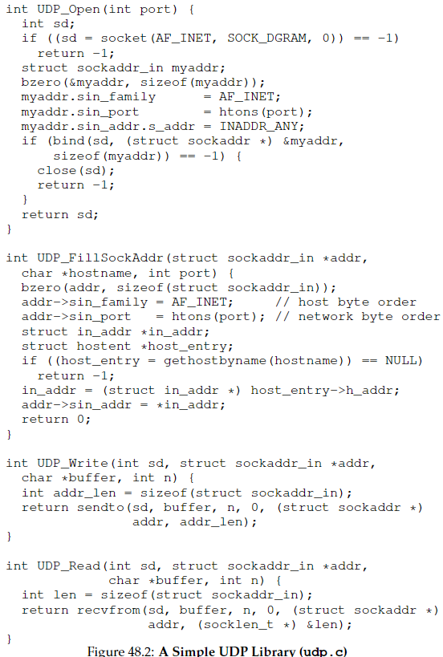
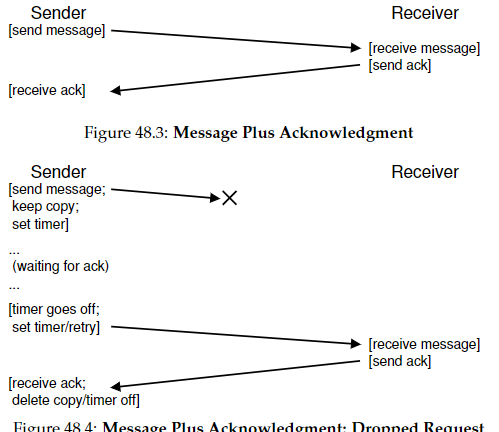
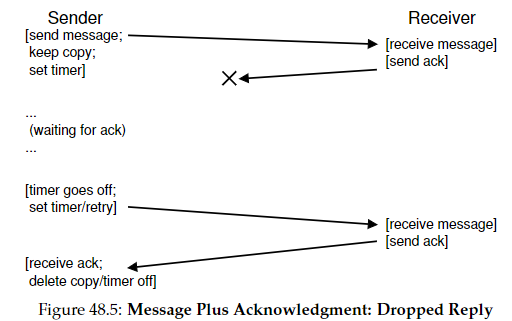

# Capítulo 48 - Sistemas Distribuídos

## 48.1 Introdução
- **Definição**: Sistemas com múltiplas máquinas cooperando para um serviço (ex: Google, Facebook).
- **Desafio Central**: Lidar com **falhas** (máquinas, redes, software) mantendo a disponibilidade.
- **Oportunidade**: Tolerância a falhas através de redundância.

---

## 48.2 Desafios Fundamentais
- **Comunicação não confiável**: 
  - Pacotes podem ser perdidos, corrompidos ou atrasados.
  - *Causas*: Corrupção de bits, falhas de hardware, congestionamento (buffer overflow).
- **Desempenho**: Minimizar mensagens e otimizar latência/largura de banda.
- **Segurança**: Autenticação e confidencialidade.

---

## 48.3 Comunicação Básica
- **Premissa**: Redes são **inerentemente não confiáveis**.
- **Mecanismo de Detecção**: 
  - **Checksums** (ex: CRC) para identificar corrupção de pacotes.
  - *Trade-off*: Eficácia vs. Custo computacional.

---

## 48.4 UDP: Camada Não Confiável
- **Características**:
  - Comunicação via *datagramas* (mensagens de tamanho fixo).
  - Não garante entrega ou ordem.
  - Leve e rápido, mas expõe falhas à aplicação.
- **Exemplo de Código**:  
  
  
  *Cliente/Servidor usando biblioteca UDP simples*.

---

## 48.5 TCP: Camada Confiável
- **Mecanismos para Confiabilidade**:
  - **ACKs + Timeout/Retry**: Confirmação de recebimento e retransmissão em caso de perda.
  - **Contadores de Sequência**: Evitam duplicação de mensagens (IDs únicos).
- **Casos de Falha**: 
 

  *(a) ACK perdido, (b) requisição perdida, (c) resposta perdida*.
- **Otimização**: Backoff exponencial para evitar congestionamento.

---

## 48.6 Abstrações de Comunicação
### 6.1. Memória Compartilhada Distribuída (DSM)
- **Ideia**: Extender memória virtual para múltiplas máquinas.
- **Problemas**: 
  - Falhas tornam partes do espaço de endereços inacessíveis.
  - Alto custo de acesso remoto → Pouco usado na prática.

### 6.2. Chamada de Procedimento Remoto (RPC)
- **Objetivo**: Simular chamada de função local em máquina remota.
- **Componentes**:
  - **Stub Generator (Compilador)**:
    - *Cliente*: Empacota argumentos (*marshaling*), envia requisição, espera resposta.
    - *Servidor*: Desempacota, chama função real, envia resultado.
  - **Biblioteca de Runtime**:
    - Trata localização (*naming*), transporte (UDP vs. TCP), falhas e concorrência (ex: *thread pools*).
- **Desafios**:
  - Argumentos complexos e grandes (fragmentação/recomposição).
  - *Endianness* (solução: padrão como XDR).
  - Chamadas assíncronas para otimização.

---

## 48.7 Princípios de Design
- **Argumento Fim-a-Fim** (Saltzer et al.):
  - Confiabilidade deve ser implementada na camada mais alta (ex: checksum de arquivo), não apenas em redes.
- **Foco em Falhas**: 
  - "Em data centers, falhas ocorrem o tempo todo" (Google).

---

## 48.8 Conclusão
- **Núcleo dos Sistemas Distribuídos**: Comunicação + tolerância a falhas.
- **RPC como Abstração Dominante**: Esconde complexidade (ex: gRPC, Apache Thrift).