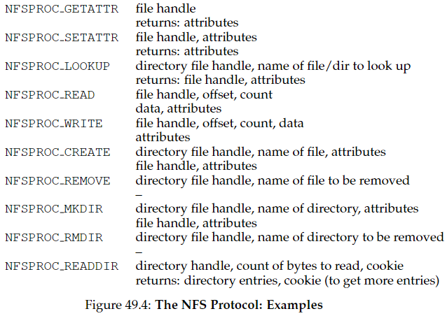

# Capítulo 48 - *Sun's Network File System (NFS)*

## 48.1 Introdução
- **Objetivo**: Sistema de arquivos distribuído para compartilhamento transparente de dados entre clientes.
- **Benefícios**: 
  - Compartilhamento centralizado de dados.
  - Administração simplificada (backups, segurança).
- **Arquitetura Básica**: 
  
  *Clientes acessam arquivos armazenados em servidor via rede.*

---

## 48.2 Arquitetura
- **Cliente-side File System**: 
  - Traduz chamadas locais (e.g., `open()`, `read()`) em mensagens de protocolo.
  - Mantém estado local (descritores de arquivo, posição do ponteiro).
- **File Server**: 
  - Armazena dados em disco.
  - Sem estado (*stateless*) → recuperação rápida após falhas.
- **Transparência**: Aplicações clientes não distinguem acesso local/remoto.

---

## 48.3 Protocolo Stateless (NFSv2)
- **Objetivo**: Recuperação rápida de falhas do servidor (sem estado compartilhado).
- **File Handle** (Identificador Único):
  - Volume ID + Inode Number + Generation Number.
- **Operações Principais**:  

  *Exemplos: LOOKUP (obter handle), READ/WRITE (dados), GETATTR (metadados)*.
- **Exemplo de Fluxo**:  
  
  *Ações para ler um arquivo (LOOKUP → READs)*.

---

## 48.4 Idempotência e Tolerância a Falhas
- **Idempotência**: Operações repetíveis sem efeitos colaterais (e.g., READ, WRITE com offset).
- **Recuperação de Falhas**:
  - Cliente retransmite após timeout:  
    
    *Casos: (1) Requisição perdida, (2) Servidor down, (3) Resposta perdida*.
- **Vantagem**: Tratamento unificado para perdas de rede/falhas do servidor.

---

## 48.5 Cache no Cliente e Consistência
- **Benefício**: Melhora desempenho (acessos locais após primeira leitura).
- **Problema**: **Consistência de Cache**:  
  
  *Clientes com versões obsoletas após atualizações*.
- **Soluções**:
  - **Flush-on-Close**: Atualizações são enviadas ao servidor no `close()`.
  - **Validação via GETATTR**: Cliente verifica última modificação antes de usar cache.
  - *Attribute Cache*: Reduz tráfego de GETATTR (atributos cacheados por ~3s).

---

## 48.6 Cache no Servidor e Persistência
- **Write Buffering**:
  - Servidor **deve** persistir dados em disco antes de confirmar WRITE.
  - *Motivo*: Garantir atomicidade em falhas (evitar dados "misturados").
- **Otimizações**: 
  - Uso de memória com bateria (*battery-backed RAM*) para writes rápidos.
  - Sistemas de arquivos otimizados (e.g., WAFL).

---

## 48.7 Implicações e Lições
- **VFS/Vnode**: Camada de abstração para múltiplos sistemas de arquivos (legado do NFS).
- **Desempenho vs. Consistência**: 
  - Cache cliente melhora desempenho, mas introduz semântica relaxada.
  - *Trade-off*: Velocidade × Visibilidade imediata de atualizações.
- **Segurança**: Versões iniciais vulneráveis; integração com Kerberos posterior.

---

## 48.8 Conclusão
- **Ideia Central**: Simplicidade e recuperação rápida via protocolo *stateless*.
- **Idempotência**: Chave para tolerância a falhas unificada.
- **Legado**: Protocolo aberto e amplamente adotado (NFSv4 mantém relevância).