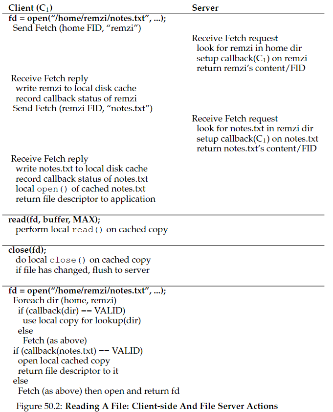
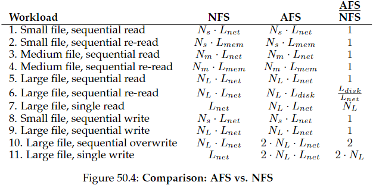

# Capítulo 50 - *The Andrew File System (AFS)*

## 50.1 Introdução e Objetivos
- **Foco principal**: Escalabilidade (suportar milhares de clientes por servidor).
- **Comparação com NFS**:
  - NFS: Verificações periódicas ao servidor (ex: GETATTR) limitam escalabilidade.
  - AFS: Protocolo otimizado para minimizar interações servidor-cliente.
- **Visibilidade para o usuário**: 
  - Semântica simples: Ao abrir um arquivo, o cliente recebe sempre a última versão consistente.

---

## 50.2. AFS Versão 1 (AFSv1)
- **Mecanismo básico**: 
  - **Whole-file caching**: Arquivos inteiros cacheados no **disco local** do cliente.
  - Fluxo: `open()` → `Fetch` (servidor envia arquivo completo) → operações locais → `close()` → `Store` (se modificado).
- **Problemas identificados** (medições!):
  - **Traversão de caminhos**: Servidor sobrecarregado resolvendo paths completos (ex: `/home/remzi/notes.txt`).
  - **Excesso de `TestAuth`**: Clientes verificavam constantemente validade do cache (similar ao GETATTR do NFS).
  - Limitação: ~20 clientes por servidor.

---

## 50.3. AFS Versão 2 (AFSv2): Protocolo Escalável
### 3.1. Inovações Chave
- **Callbacks**:
  - Servidor **notifica clientes** quando arquivos cacheados são modificados (substitui `TestAuth`).
  - Analogia: Interrupções vs. Polling.
- **File Identifier (FID)**:
  - Substitui paths completos (similar ao file handle do NFS).
  - Estrutura: `Volume ID` + `File ID` + "Uniquifier" (evita reuso de IDs).
- **Caching hierárquico**:
  - Cliente caminha pelo path (ex: `/home` → `remzi` → `notes.txt`), cacheando diretórios/arquivos localmente e estabelecendo callbacks para cada.
- **Fluxo de Leitura**:  
  
  *Cliente faz Fetch sequencial de diretórios/arquivo, cacheia e estabelece callbacks.*

### 3.2. Modelo de Consistência
- **Atualizações visíveis**:
  - No `close()`, servidor recebe nova versão e **"quebra" callbacks** de clientes com cópias cacheadas.
  - Próximo `open()` nesses clientes invalida cache e refetch.
- **Exceção (mesma máquina)**:
  - Atualizações são visíveis imediatamente (semântica Unix local).
- **Concorrência entre clientes**:
  - **Last closer wins**: Último `close()` "vence" (arquivo inteiro sobrescrito).
  - *Contraste com NFS*: NFS pode misturar blocos de clientes → corrupção potencial.

### 3.3. Recuperação de Falhas
- **Cliente recuperado**:
  - Após falha, cliente considera cache "suspeito" → Valida arquivos via `TestAuth` antes de usar.
- **Servidor recuperado**:
  - Callbacks são voláteis (em memória). Após reboot, servidor perde estado.
  - Clientes devem invalidar caches (mecanismo de "heartbeat" ou notificação).

---

## 50.4. Desempenho vs. NFS
### 4.1. Análise Qualitativa:  

*Workloads típicas e impacto no desempenho.*
- **Vantagens do AFS**:
  - **Re-leitura de arquivos grandes**: Acesso local (disco) vs. refetch no NFS (rede).
  - Caso comum (arquivo cacheado): Desempenho próximo ao disco local.
- **Desvantagens**:
  - **Sobrescrita sequencial**: AFS faz fetch do arquivo antigo antes de sobrescrever (NFS evita).
  - **Acesso aleatório em arquivos grandes**: AFS transfere o arquivo inteiro; NFS transfere apenas blocos necessários.

### 4.2. Escalabilidade Comprovada
- **Resultado**: Suporte a ~50 clientes/servidor (vs. 20 no AFSv1).
- **Fator crítico**: Redução drástica de mensagens servidor-cliente (callbacks + FID).

---

## 50.5. Outras Inovações
- **Namespace global único**: Todos os clientes veem os arquivos com o mesmo caminho.
- **Segurança robusta**: Autenticação e ACLs (Access Control Lists) granulares.
- **Gerenciamento simplificado**: Ferramentas para balanceamento de carga (volumes móveis).

---

## 50.6. Conclusão e Legado
- **Influência duradoura**:
  - Ideias incorporadas em sistemas modernos (ex: callbacks no NFSv4).
  - Foco em medição → design orientado por dados (Patterson's Law).
- **Declínio prático**: Dominância de NFS/CIFS no mercado, mas conceitos fundamentais permanecem.
- **Lições-chave**:
  - Escalabilidade exige minimização de estado no servidor e interações.
  - Consistência "perfeita" é impossível; aplicações críticas precisam de mecanismos extras (ex: locks).