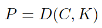
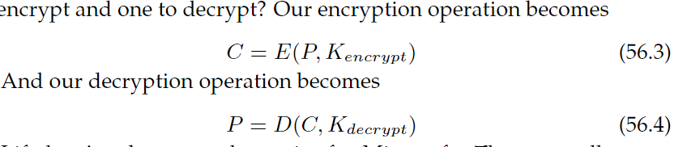

# Chapter 56 - Protecting Information with Cryptography

## 56.1 Introduction

what's left for the operating system to worry about, from a security perspective?

> "not everything is controlled by the operating system"

we assume that we are going to lose the data (or that an oppnent will try to alter it improperly).

we use **cryptography** to transform the data in a "not understandable" data.

> ✝️ how to protect information outside the OS's domain?

---

## 56.2 Cryptography

the basic ideai behind cryptography is to take a piece of data and use an algorithm (**cipher**), usually augmented with a second piece of information (**key**), to convert the data into a different form.

we start with data _P_ (**plaintext**), a key _K_ and an encryption algorithm _E()_. we end up with _C_ (**ciphertext**).

with the decryption algorithm _D()_ we can revert it:

**all the cryptography's benefits relies on the secrecy of the key**, because de/crypto algorithms are known.

**symmetric cryptography** happens when you use the same key to enctrypt and decrypt the data.

---

## 56.3 Public Key Cryptography

think that you are Microsoft, you cant share the same key of authentication for every users.

in other way, Microsoft could generate a different key for each user, but that would require delivering unique key to hundreds of millions of users, not to mention keeping track of all those keys.

so the genius came and said "what if we use two keys, one to encrypt and one to decrypt?"

now Microsoft can tell everyone ther decrypton key, but keep the encrypt key secret.

### Alice and Bob

alice wants to use PK to communicate secretly with her pal bob, ald also wants to be sure bob can authenticate her messages. alice and bob each have their own PK. 

if alice encrypts with her own private key, she'll authenticate the message, since bob use her PK to decrypt.

but every one knows alice's pk, so alice must encrypt again with bob's pk.

this is expensive.

---

## 56.4 Cryptographic Hashes

we can protect data integrity by using cryptography. we can reduce the costs of that integrity check by hashing the dat and encrypting just the hash, instead of encrypting the entire thing. 

its necesary to take care with **hash collisions**.

we can use **cryptographic hash**, that have this properties:
- it is computanionally infeasible to find two inputs that will produce the same hash value
- any change to an input will result in an unpredictable change to the resulting hash value
- it is computionally infeasible to infer any properties of the input based only on the hash value

we take a plaintext _P_ and a hashing algorithm _H()_ and then:

$$
S = H(P)
$$

---

## 56.5 Cracking Cryptography

with the mordern standard, there are no known ways to read data encrypted with these algorithms without the key.

software flaws in your system about how to create and use the keys.

one way is guessing the key.

and again, **THE CRYPTOGRAPHY’S BENEFIT RELIES ENTIRELY ON THE SECRECY OF THE KEY**.

---

## 56.6 Cryptography and Operating Systems

the OS has control of and access to all resources on a computer. which implies that you have encrypted info on the computer, and you have the necessary key to decrypt it on the same computer. 

> "A criptografia não é uma solução mágica contra um sistema operacional desonesto ou comprometido que tem acesso direto à sua chave ou aos seus dados em texto puro. Sua eficácia depende criticamente do momento do comprometimento e do acesso à chave. Operações unidirecionais são uma exceção útil"

in a distributed enviroment, if we encrypt data on one machine and the send it to the other,s, all the intermediate components wont be part of our machine, and thus wont have access to the key, only the final machine will have the key to decrypt.

---

## 56.7 At-Rest Data Encryption

### Basic Concept
- **Objective**: Protect sensitive data on storage devices (HDD, SSD, etc.) through encryption.
- **Limitation**: Encrypted data must be decrypted for computational use (except for pure storage).

### Implementation
#### Full Disk Encryption (FDE)
- **Scope**: Encrypts **the entire storage device** (not just hard drives).
- **Methods**:
  - **Hardware**: Integrated into the device (e.g., SSDs with native encryption).
  - **Software**: Implemented by the OS (e.g., BitLocker (Windows), FileVault (macOS)).
- **Process**:
  1. **Boot**: User provides key (or passphrase) for initial decryption.
  2. **Transparency**: After authentication, encryption/decryption are automatic.
  3. **Memory**: Data **always decrypted in RAM** (buffers, user memory).
  4. **Storage**: Data **never written in plaintext** to the device.

#### Alternative Granularities
- Encryption can be applied at:  
  `individual files` → `data blocks` → `entire file systems`.

### Performance
- **Software**: Noticeable overhead (up to a few % latency in I/O-heavy operations).
- **Hardware**: Near-zero overhead (uses dedicated circuits).

### Security Limitations
#### What it does **NOT** protect against:
1. Unauthorized access by legitimate OS users (depends on **OS access control**).
2. Application vulnerabilities (e.g., *buffer overflows*, SQL injection).
3. Malicious administrators (can access decrypted data in RAM).
4. OS compromise (key is available after *boot*).

#### What it **protects** against:
- **Primary scenario**: Physical theft of the storage device.  
  - E.g., Lost mobile device, resold HDD → Data unreadable without the key.
- **Effective protection**: When accessed **outside the original OS** (ignores permissions/FS).

### Key Use Cases
1. **Mobile devices**: Data protected if lost/stolen.
2. **Data archiving**:  
   - Encrypt at creation → Key **not** stored on the system.  
   - Risks: Key loss = permanent data loss.
3. **Cloud Computing**:  
   - Encrypt data **before** sending to cloud (don't trust the provider).
4. **Password Vaults**:
   - Stores encrypted passwords (master key decrypts on demand).  
   - **Key management**:  
     - Master key **never** stored on persistent storage.  
     - Temporarily kept in RAM after user input.  
     - Discarded at: logout, shutdown, or application exit.

### Critical Challenges
- **Key Management**:  
  - Destroy key after use (security) vs. reuse (usability).  
  - Common compromise: Key kept in RAM for limited time.
- **Data Exposure**:  
  - Plaintext data in RAM/caches during operations → Vulnerable if OS compromised.

---

## 56.8 Cryptographic Capabilities in Operating Systems

### Core Problem & Solution
- **Traditional capability weakness**: User-held capabilities can be forged for unauthorized access.
- **Cryptographic solution**: Creates unforgeable capabilities using encryption. Trusted entities generate encrypted data structures that prove access rights.

### Implementation Approaches
#### Symmetric Cryptography
- **Requirements**: 
  - Same key shared between capability creator and resource controller
  - Best suited for single-system or tightly coupled systems
- **OS Use Cases**:
  - Avoid ACL overhead in large-scale/distributed systems
  - Enable transferable rights across machines
  - Optimal when key distribution is manageable (e.g., trusted clusters)

#### Public Key Cryptography
- **Mechanics**:
  - Creator signs capability with **private key**
  - Resource controller verifies with **public key**
- **OS Advantages**:
  - No co-location required between creator/verifier
  - Selective key distribution possible for sensitive capabilities
  - No shared secrets between systems

### OS-Centric Features
1. **Rich Metadata Support**:
   - Embed expiration times, user IDs, IP restrictions
   - Cryptographic integrity prevents tampering
   - Enables fine-grained access policies (e.g., network-bound capabilities)

2. **State Elimination**:
   - Resource controllers need **no access lists** – validate capability signatures on-demand
   - Reduces memory/processing overhead at scale

3. **Transferability**:
   - Capabilities move with users across machines
   - Maintains access context without central auth checks

### Security Requirements
- **Brute-force resistance**: Capability length must make guessing computationally infeasible
- **Key protection**: Private keys only accessible to trusted creators
- **Binding mechanisms**: Capabilities can enforce context restrictions (e.g., source IP)

### Limitations & Considerations
- **Symmetric challenges**: Key distribution complexity in distributed OS environments
- **Metadata exposure**: Public key capabilities may reveal policy details unless encrypted
- **Revocation difficulty**: Still requires mechanisms to invalidate capabilities before expiration

---

